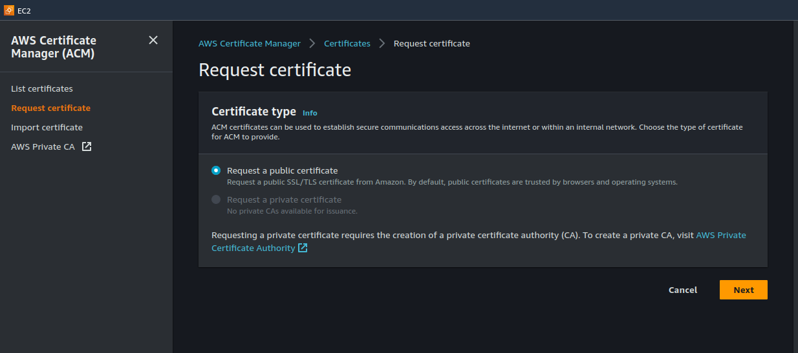
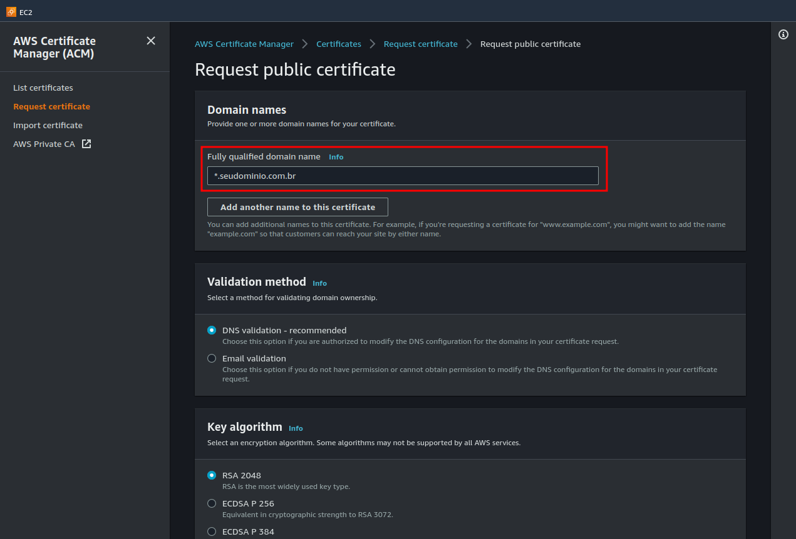
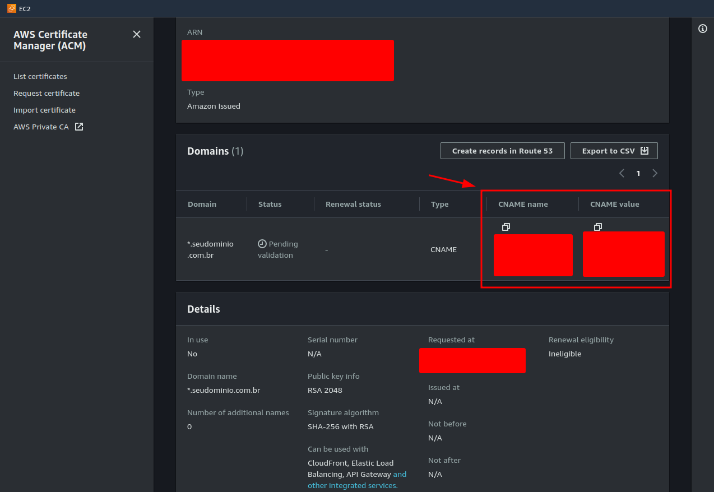
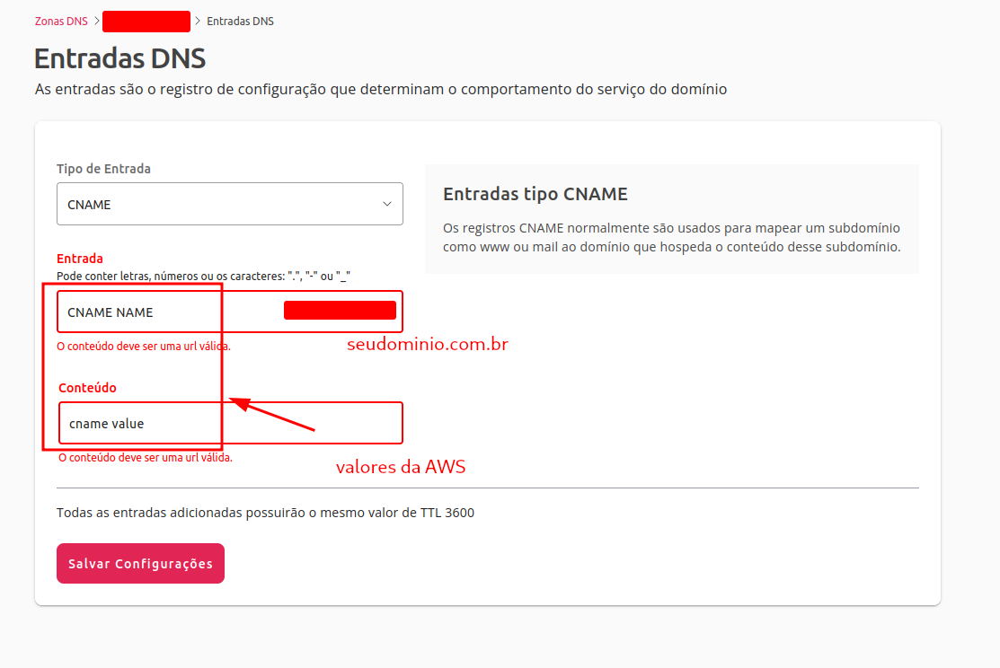
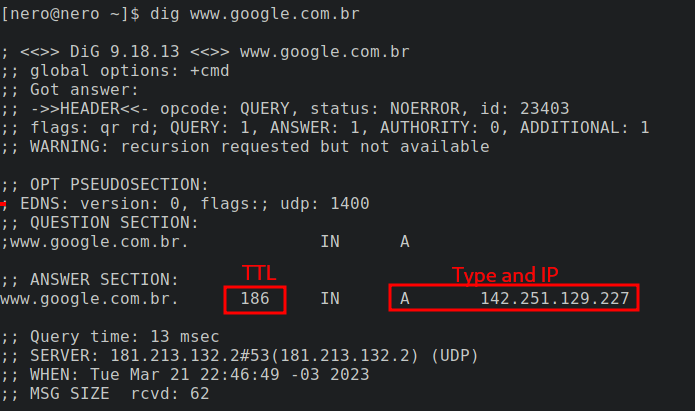
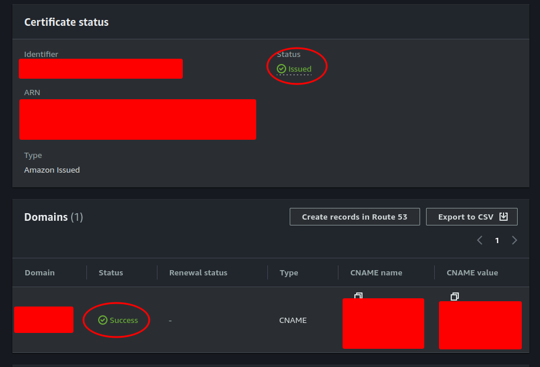
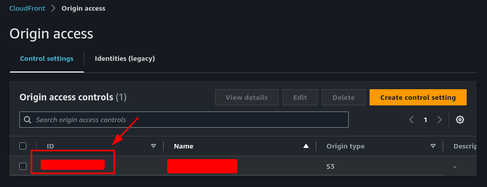
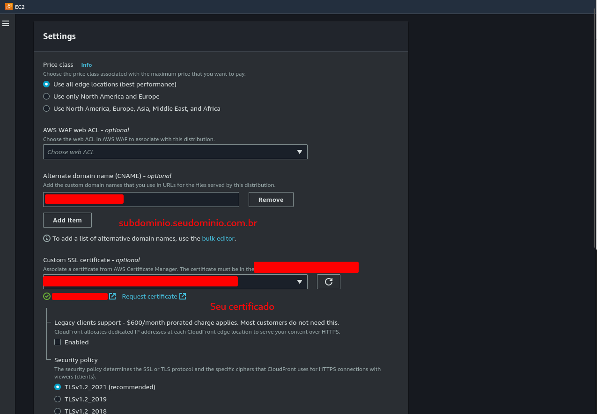
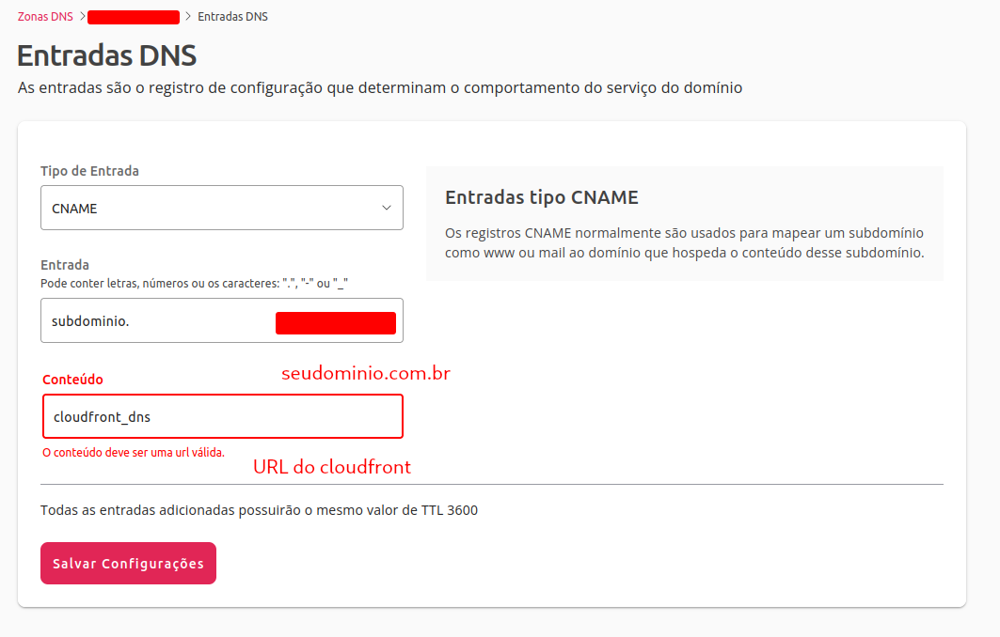

## Como adicionar sub-domínio (cloudfront) na locaweb


<p>
Possuo um dominio muito antigo na locaweb e decidi fazer um novo site pra fins pessoais e optei por utilizar o 
mesmo dominio para esse fim.
</p>

<p>No tutorial abaixo ensinarei como adicionar um sub-domínio na locaweb que direcione para o domínio AWS cloudfront.</p>

#### Entendendo DNS Record Types

<p>Antes de começarmos as edições, é importante um review sobre o que são DNS Record Types.</p>

<p>
DNS records são basicamente instruções de direcionamento para servidores DNS, a ideia é que cada tipo possui
um direcionamento especifico. Esse "registros" ficam armazenados no servidores DNS em um arquivo de texto chamado "Zone File".
</p>

<p>Os tipos de registros mais comuns são:</p>

- A: Faz o mapeamento de um DNS para valor IPv4 (ex: 11.22.33.44)
- AAAA: Faz o mapeamento de um DNS para valor IPv6 (ex: 2001:db8:3333:4444:5555:6666:7777:8888)
- CNAME (canonical name): Opção utilizada para mapear de um dominio para outro (exceto ip). (ex: example.com => app.example.com)

<p>Existem outros tipos de registros, porém, não vamos nos aprofundar. O que nos interessa para esse mapeamento é
o CNAME, que vai nos permitir redirecionar um sub-domínio para o link do cloudfront.</p>


#### Criando Certificado na AWS


<p>O primeiro passo é criar um certificado na AWS, que será utilizado para o sub-domínio. 
No console da AWS, vá até o console da AWS e siga os passos:</p>

##### Passo 1

<p>Crie um novo certificado no Certificate Manager (ACM)</p>




##### Passo 2

<p>
Preencha o campo do seu dominio utilizando um wildcard (*).
Ex: *.seudominio.com.br
</p>



##### Passo 3

<p>Copie o CNAME name e CNAME value para o record type da locaweb</p>



#### Passo 4

<p>Agora que já temos o CNAME do nosso dominio, vamos adiciona-lo no nosso zone file da locaweb.
Basta ir no seu painel (https://painel-dns.locaweb.com.br/seudominio.com.br) e adicionar o CNAME.
</p>




<p>O TTL é o time-to-live, basicamente é o tempo do cache de direcionamento DNS, ou seja,
o tempo em que o record configurado será valido, caso você troque a configuração do record, precisará
aguardar o tempo do TTL encerrar (Tempo sem segundos). É possível inspecionar esse tempo utilizando o terminal
linux combinado com o domando dig.
Ex:
</p>

```shell
dig www.google.com.br
```

resultado:



#### Passo 5

<p>Agora que fizemos o link entre o certificado e o servidor DNS, precisamos aguardar a validação do mesmo.
O cerificado será valido quando os status ficarem nessa situação:
</p>



<p>Esse processo pode levar algumas horas, portanto, aguarde.</p>
<p>Após o processo finalizar, é hora de alterar a permissão do nosso s3
site para permitir acesso ao Origin Access do cloudfront.
</p>

<p>Para criar o Origin Access, vá até o CloudFront pelo AWS console e abra o menu
Origin Access, e crie um novo registro.</p>



<p>
Depois de criado, copie o ID que será utilizado no S3 que possui o link com
seu cloudfront.
</p>

<p>A permissão do seu bucket deve estar parecido com essa:</p>

```json
{
    "Version": "2012-10-17",
    "Statement": [
        {
            "Sid": "2",
            "Effect": "Allow",
            "Principal": "*",
            "Action": "s3:GetObject",
            "Resource": "arn:aws:s3:::<SEU_BUCKET_NAME>/*"
        },
        {
            "Sid": "Statement1",
            "Effect": "Allow",
            "Principal": {
                "AWS": "arn:aws:iam::cloudfront:user/CloudFront Origin Access Identity <ID_ACCESS_ORIGIN>"
            },
            "Action": "s3:GetObject",
            "Resource": "arn:aws:s3:::<SEU_BUCKET_NAME>/*"
        }
    ]
}
```

#### Passo 6

<p>Agora, vá até o seu cloudfront distribution que possuí o link com o s3. 
Vamos criar um dominio alternativo para a distribuição, alternando as seguintes propriedades:</p>



<p>O mesmo certificado pode ser utiliza para outros sub-dominios, justamente por conta do wildcard que adicionamos
no passo 2 (*.seudominio.com.br)</p>


#### Passo 7

<p>No ultimo passo desse processo, vamos adicionar o sub-dominio escolhido na locaweb.</p>



<p>Após esse passo, seu sub-dominio deverá ser direcionado para o cloudfront utizando o certificado criado.
Caso tenho algum problema de acesso, como 403 (forbidden), verifica as permissões do bucket.
Caso tenho problemas com cors, verifique seu Origin Access configurado no bucket.</p>
